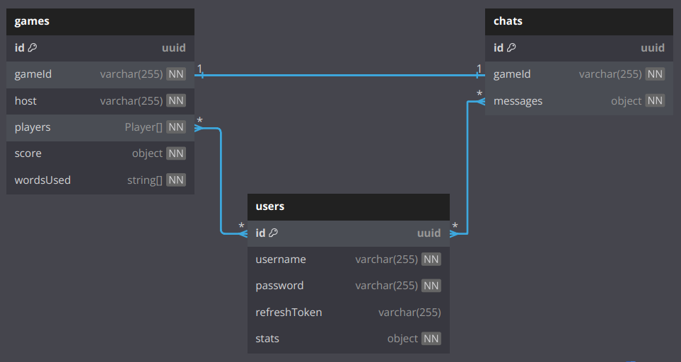

# Node.js-Based Game "Alias"

## Table of Contents

### General

- [Game Description](../../README.md#game-description)
- [Rules](../../README.md#rules)
- [System Requirements](../../README.md#system-requirements)
- [Setup and Installation](../../README.md#system-requirements#setup-and-installation)
- [Troubleshooting](../../README.md#system-requirements#troubleshooting)

### Technical

- Project Structure
    - [Files & Folders](../project-structure/files-and-folders.md#directory-structure)
    - [Modules](../project-structure/core-modules.md#core-modules)
- Data Architecture
    - [Data Base Schemas](#structure)
    - [Interfaces](./interfaces.md#game-interfaces-documentation)
    - [Dtos](./dtos.md#dtos)
- APIs
    - [Auth](../APIs/auth.md#authentication)
    - [Socket Events](../APIs/socket-events.md#socket-events-documentation)
- Guides
    - [Testing](../guides/testing.md#running-tests-in-nestjs-with-jest)
    - [Deployment](../guides/deployment.md#deploying-a-nestjs-application-to-heroku)

### Additional Information

- [Future Enhancements](../future-enhancements.md#future-enhancements)
- [FAQ](../FAQ.md#faq)

## In this file:

- [Structure](#structure)
- [Schemas](#schemas)
  - [User](#user)
  - [Chat](#chat)
  - [Games](#games)

# Structure

This document provides a detailed overview of the database structure used in the project.

# Schemas

## User

The User schema defines the structure of user data for the Alias Game project. It includes information such as the username, password, refresh token, and game-related statistics.

### Fields

#### 1. username

- `Type:` String
- `Required:` Yes
- `Unique:` Yes
- `Description:` The unique username used by the user to log into the system.

#### 2. password

- `Type:` String
- `Required:` Yes
- `Description:` The hashed password of the user for authentication.

#### 3. refreshToken

- `Type:` String
- `Required:` No
- `Description:` The refresh token used for generating new authentication tokens after login sessions expire.

#### 4. stats

- `Type:` Object
- `Required:` Yes (default values provided)
- `Description:` A nested object containing statistics related to the user's game performance.

#### Stats Object Fields:

| Parameter       | Type   | Description                                                  |
| --------------- | ------ | ------------------------------------------------------------ |
| `gamesPlayed`   | Number | The total number of games the user has played.               |
| `wins`          | Number | The number of games the user has won.                        |
| `loses`         | Number | The number of games the user has lost.                       |
| `draw`          | Number | The number of games that ended in a draw.                    |
| `wordsGuessed	`  | Number | The number of words the user has guessed.                    |
| `wellDescribed` | Number | The number of times the user's descriptions were rated well. |

 

## Chat

The Chat schema defines the structure of chat data for the Alias Game project. It stores messages exchanged during a game, linking the chat to a specific game and detailing the users involved in each message.

### Fields

#### 1. gameId

- `Type:` String
- `Required:` Yes
- `Description:` The unique ID of the game this chat belongs to. This is used to associate the chat with a specific game instance.

#### 2. messages

- `Type:` Array
- `Description:` An array of message objects. Each object contains the details of a message sent in the chat.

#### Message Object Fields:

| Parameter   | Type                         | Description                                           |
| ----------- | ---------------------------- | ----------------------------------------------------- |
| `_id`       | ObjectId (auto-generated)    | Unique identifier for the chat.                       |
| `userId`    | ObjectId (references User)   | The MongoDB ObjectId of the user sending the message. |
| `userName`  | String                       | The display name of the user sending the message.     |
| `content`   | String                       | The content of the message sent by the user.          |
| `timestamp` | Date (default: current time) | The time when the message was sent.                   |

 

## Games

The Games schema tracks data related to individual game instances, including player information, team scores, and words used during the game.

### Fields

#### 1. gameId

- `Type:` String
- `Required:` Yes
- `Description:` A unique identifier for each game instance.

#### 2. host

- `Type:` String
- `Required:` Yes
- `Description:` The user who initiated and hosts the game.

#### 3. players

- `Type:` Array
- `Description:` An array of player objects containing details about each participant in the game.

#### Player Object Fields:

| Parameter     | Type   | Description                                             |
| ------------- | ------ | ------------------------------------------------------- |
| `userId`      | String | The unique identifier for the player (custom ID).       |
| `name`        | String | The player's name.                                      |
| `team`        | String | The team the player belongs to (e.g., "red" or "blue"). |
| `inGameStats` | Object | An object tracking the player's in-game performance.    |

#### inGameStats Object Fields:

| Parameter       | Type   | Description                                                    |
| --------------- | ------ | -------------------------------------------------------------- |
| `wordsGuessed`  | Number | The number of words the player has guessed.                    |
| `wellDescribed` | Number | The number of times the player's descriptions were rated well. |

#### 4. score

- `Type:` Object
- `Required:` Yes (default: { red: 0, blue: 0 })
- `Description:` The total score for each team.

| Parameter | Type   | Description             |
| --------- | ------ | ----------------------- |
| `red`     | Number | Score for the red team. |
| `blue`    | Number | Score for the red team. |

#### 5. wordsUsed

- `Type:` Arrays of Strings
- `Required:` Yes
- `Description:` A list of words that have been used during the game.

 
